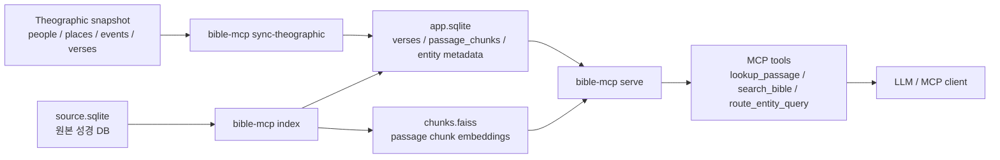
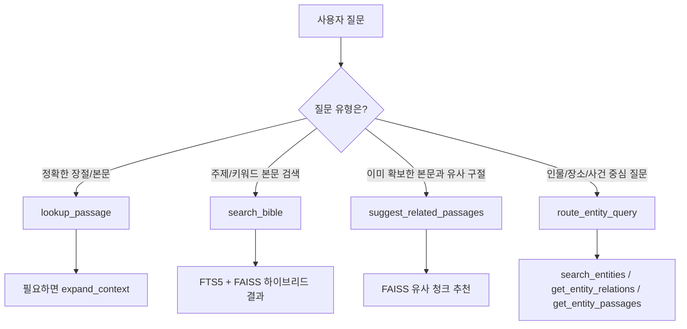

## bible-mcp

- 성경 장절 조회
- 본문 키워드/의미 검색
- 인물, 장소, 사건 메타데이터 조회
- 인물 관계 질의
- 엔티티와 연결된 대표 구절 조회
- MCP tool 형태의 구조화된 응답 반환

즉, Bible MCP는 "답을 직접 말하는 앱"이 아니라,
앞단 LLM이나 클라이언트가 호출할 수 있는 **성경 검색 엔진 + 구조화된 조회 도구 묶음** 입니다.

## 핵심 Use Case

현재 구현 기준으로 핵심 use case는 아래 5가지입니다.

1. 정확한 장절 조회
   - 예: `창1:1`, `창 1:1-3`, `롬8장`, `John 3:16`
   - 적합한 도구: `lookup_passage`, `expand_context`

2. 주제/키워드 본문 검색
   - 예: `믿음`, `창조`, `하나님 나라`, `태초`
   - 적합한 도구: `search_bible`

3. 엔티티 검색
   - 예: `아브라함`, `예루살렘 위치`, `출애굽 사건`
   - 적합한 도구: `search_entities`, `route_entity_query`

4. 관계 질의
   - 예: `예수의 제자들`, `다윗의 아버지`, `야곱의 자녀`
   - 적합한 도구: `get_entity_relations`, `route_entity_query`

5. 엔티티 대표 구절 질의
   - 예: `예루살렘 대표 구절`, `출애굽 사건 관련 구절`, `아브라함 등장 구절`
   - 적합한 도구: `get_entity_passages`, `route_entity_query`

## 권장 사용 방식

MCP 클라이언트나 LLM 애플리케이션이 아래 규칙으로 호출하는 방식을 권장합니다.

1. 사용자가 정확한 성경 참조를 말했으면 `lookup_passage`
   - 문맥이 더 필요하면 `expand_context`
   - 사용자가 본문 자체를 요청한 경우에는 `passage_text` 전문을 그대로 반환하고 요약하지 않는 것이 권장됩니다.
   - 주제 질문에 성경 구절을 인용해 답할 때도, 인용한 구절은 한 줄 요약 대신 본문 전문을 그대로 보여주는 것이 좋습니다.
   - 더 엄격하게는, 어떤 형식의 답변이든 성경 구절이나 참조를 포함한다면 각 구절은 전문을 먼저 보여주고 그 다음에만 설명을 덧붙이는 방식이 안전합니다.

2. 사용자가 주제나 키워드를 말했으면 `search_bible`
   - 이 서버는 본문 후보를 찾는 역할을 하고, 최종 설명 생성은 앞단이 담당

3. 사용자가 인물/장소/사건 중심 질문을 했으면 `route_entity_query`
   - 예: `예수의 제자들`, `예루살렘 대표 구절`, `요단강 위치`

4. 엔티티 질의가 한국어에서 실패하면, 앞단 LLM이 영어 후보를 순차 재시도
   - 예: `요단강` -> `Jordan` -> `Jordan River`
   - `route_entity_query`를 원문으로 먼저 1회 호출하고, `not_found`일 때만 영어 후보로 같은 도구를 순차 재호출하는 방식이 권장됩니다.
   - 성공, 모호성, 에러 중 하나가 나오면 즉시 중단하고, 최종 답변은 한국어로 생성합니다.

5. 최종 사용자 응답은 한국어로 생성
   - Bible MCP는 구조화된 근거 데이터를 제공하고, 한국어 설명 생성은 앞단 LLM이 맡는 형태가 가장 자연스럽습니다.
   - 단, 직접 장절/본문 요청에서는 한국어 요약문 대신 성경 본문 전문을 우선 그대로 보여주는 것이 좋습니다.

## 한계

현재 구현의 주요 한계는 아래와 같습니다.

- 일반 대화형 질의응답 시스템은 아닙니다.
  - 예: `예수는 왜 십자가에 달렸나` 같은 설명형 질문에 바로 완성 답을 만드는 역할은 아닙니다.

- 엔티티 관계 질의는 direct relation 중심입니다.
  - 예: `야곱의 손자`, `다윗의 후손 전체` 같은 multi-hop 질의는 현재 범위 밖입니다.

- `search_entities`를 직접 호출할 때 기본 범위는 `people`입니다.
  - 장소/사건은 `entity_type=places|events`를 명시하는 편이 안전합니다.

- 한국어 엔티티 메타데이터는 아직 제한적입니다.
  - 현재는 영어 중심 메타데이터를 사용하고, 한국어 질의 실패 시 앞단 LLM의 영어 재시도를 권장합니다.

- `summarize_passage`, `suggest_related_passages`는 질문을 바로 넣는 도구가 아닙니다.
  - 이미 확보한 본문 텍스트를 넣어 요약하거나 유사 구절을 찾는 후처리 도구에 가깝습니다.
  - 특히 직접 장절 조회 응답을 대체하는 용도로 쓰면 안 되고, 본문 전문을 보여준 뒤 사용자가 따로 요약을 요청했을 때만 쓰는 편이 안전합니다.

## 한눈에 보기

준비가 끝나면 보통 아래 파일들이 생깁니다.

- `data/source.sqlite`
  사용자가 준비한 성경 원본 DB
- `data/app.sqlite`
  bible-mcp가 내부적으로 사용하는 앱 DB
- `data/chunks.faiss`
  본문 검색용 벡터 인덱스
- `data/vendor/theographic/...`
  내려받은 성경 메타데이터 스냅샷

## 준비물

- Python `3.12` 이상
- 터미널 사용 가능 환경
- 성경 본문이 들어 있는 SQLite 파일 1개
- 인터넷 연결
  - `fetch-theographic` 단계에서 GitHub에서 메타데이터를 내려받습니다.
  - 첫 `index` 단계에서 임베딩 모델이 로컬에 없으면 추가 다운로드가 일어날 수 있습니다.

## 빠른 제품 관점 요약

이 프로젝트를 실제로 붙여 쓸 때는 보통 아래처럼 이해하면 됩니다.

- `lookup_passage`: 정확한 장절 조회
- `search_bible`: 본문 검색
- `route_entity_query`: 엔티티 중심 자연어 질의 진입점
- `get_entity_relations`: 사람 관계 질의의 저수준 도구
- `get_entity_passages`: 엔티티 대표 구절 조회의 저수준 도구

권장 진입점은 대부분 `lookup_passage`, `search_bible`, `route_entity_query` 세 개입니다.
앞단 애플리케이션은 이 결과를 받아 한국어 답변을 구성하면 됩니다.

## 구조 선택 이유

이 프로젝트는 "SQLite 하나에 모든 것을 넣는 구조"도 아니고, "별도 벡터 DB를 반드시 운영해야 하는 구조"도 아닙니다.
현재는 **SQLite + FTS5 + FAISS** 조합을 사용합니다.

- `data/source.sqlite`
  사용자가 가진 원본 성경 DB입니다.
- `data/app.sqlite`
  본문 청크, FTS 인덱스 대상 데이터, 엔티티 메타데이터를 담는 앱 DB입니다.
- `data/chunks.faiss`
  본문 청크 임베딩을 저장하는 벡터 인덱스입니다.

이 구성을 택한 이유는 아래와 같습니다.

- 로컬 실행과 배포가 단순합니다.
  - PostgreSQL, Elasticsearch, 별도 벡터 DB 없이도 바로 실행할 수 있습니다.

- 정확한 단어 검색과 의미 검색을 둘 다 확보할 수 있습니다.
  - 정확한 키워드, 장절 근처 표현은 SQLite `FTS5`가 잘 잡습니다.
  - 표현이 달라도 의미가 비슷한 주제 질의는 임베딩 + `FAISS`가 보완합니다.

- 데이터 점검과 복구가 쉽습니다.
  - 앱 DB는 `sqlite3`로 직접 열어 확인할 수 있고, 벡터 인덱스는 `chunks.faiss` 파일로 분리되어 있어 재생성이 단순합니다.

- 역할 분리가 명확합니다.
  - 원본 DB는 "성경 본문 소스"
  - 앱 DB는 "검색/메타데이터용 가공 결과"
  - FAISS는 "의미 검색용 인덱스"

즉, 이 프로젝트는 "벡터 DB 중심 제품"이라기보다,
**성경 검색용 앱 DB 위에 FTS와 벡터 검색을 함께 얹은 하이브리드 검색 서버**에 가깝습니다.

### 간단한 아키텍처 그림



한 줄로 보면, 원본 성경 DB와 메타데이터 스냅샷을 가공해서 `app.sqlite`와 `chunks.faiss`를 만들고,
`serve` 단계에서 둘을 함께 읽어 장절 조회, 하이브리드 본문 검색, 엔티티 질의를 제공하는 구조입니다.

## 검색 방식

이 프로젝트의 검색은 목적에 따라 다르게 동작합니다.

### 간단한 검색 흐름 그림



실제로는 먼저 "정확한 참조인지", "주제 검색인지", "엔티티 질문인지"를 구분한 뒤,
그에 맞는 도구로 보내는 방식이 가장 안정적입니다.

### 0. 정확한 장절 조회

- 도구: `lookup_passage`, `expand_context`
- 용도:
  - 사용자가 `창 1:1`, `롬 8장`, `John 3:16`처럼 정확한 참조를 준 경우
- 특징:
  - 검색보다 "정확 조회"에 가깝습니다.
  - 이 경우에는 요약보다 본문 전문 반환이 우선입니다.

### 1. 주제/키워드 본문 검색

- 도구: `search_bible`
- 용도:
  - `믿음`, `자녀 교육`, `하나님 나라`, `태초`처럼 주제나 키워드를 찾는 경우
- 동작:
  - `FTS5` 키워드 검색 후보를 찾습니다.
  - 같은 질의를 임베딩해서 `FAISS` 의미 검색 후보도 찾습니다.
  - 두 결과를 합쳐 최종 순위를 만듭니다.

현재 구현 기준으로 `search_bible`은 순수 벡터 검색이 아니라 **하이브리드 검색**입니다.
점수는 현재 `keyword 0.6 + semantic 0.4` 방식으로 합산합니다.

그래서 아래처럼 이해하면 됩니다.

- 단어가 정확히 들어 있는 본문을 찾는 일:
  - FTS 쪽이 강합니다.
- 표현이 달라도 비슷한 주제를 찾는 일:
  - 임베딩 + FAISS 쪽이 강합니다.
- 최종 결과:
  - 두 방식을 섞어 한쪽의 약점을 다른 쪽이 보완합니다.

### 2. 유사 본문 추천

- 도구: `suggest_related_passages`
- 용도:
  - 이미 확보한 본문과 비슷한 다른 구절을 찾고 싶을 때
- 동작:
  - 입력 텍스트를 임베딩한 뒤 `FAISS`에서 유사 청크를 찾습니다.

이 도구는 질문을 바로 던지는 진입점이라기보다,
**이미 확보한 본문을 기준으로 유사 본문을 넓혀 가는 후처리 도구**로 보는 편이 맞습니다.

### 3. 인물/장소/사건 검색

- 도구: `search_entities`, `route_entity_query`
- 용도:
  - `아브라함`, `예루살렘`, `출애굽 사건`처럼 엔티티 중심 질의
- 동작:
  - 본문 임베딩 검색이 아니라 메타데이터와 alias를 기반으로 엔티티를 찾습니다.

### 4. 관계/대표 구절 검색

- 도구: `get_entity_relations`, `get_entity_passages`, `route_entity_query`
- 용도:
  - `다윗의 아버지`, `예수의 제자들`, `예루살렘 대표 구절`
- 동작:
  - 엔티티 관계 테이블과 엔티티-구절 링크를 사용합니다.

## 번역본을 바꿀 때

원본 성경 DB를 같은 구조의 다른 번역본으로 바꾸면, 예를 들어 `개역개정`에서 `한글개역`으로 바꾸면,
`bible-mcp index`를 다시 실행하는 것이 맞습니다.

이유는 아래와 같습니다.

- `verses` 테이블 본문이 바뀝니다.
- 그 본문으로부터 `passage_chunks.text`가 다시 만들어집니다.
- 그 청크 텍스트를 기반으로 `FTS` 인덱스와 `FAISS` 벡터가 다시 생성되어야 합니다.

실무적으로는 아래처럼 이해하면 됩니다.

- 메타데이터만 바뀌지 않았다면 `sync-theographic`를 다시 할 필요는 보통 없습니다.
- 본문 번역이 바뀌었다면 `index`는 반드시 다시 해야 합니다.

주의:

- 현재 무결성 검사는 주로 chunk ID와 매핑 일치 여부를 확인합니다.
- 같은 장절 범위를 유지한 채 본문만 바뀌면, 오래된 `chunks.faiss`가 남아 있어도 형식상 통과할 수 있습니다.
- 따라서 번역본 교체 후에는 기존 `app.sqlite`, `chunks.faiss`를 그대로 신뢰하지 말고 `bible-mcp index`를 다시 실행하는 편이 안전합니다.

## 1. 설치

### 1-1. 가상환경 만들기

프로젝트 폴더에서 아래를 실행합니다.

```bash
python3 -m venv .venv
```

### 1-2. 가상환경 켜기

macOS / Linux:

```bash
source .venv/bin/activate
```

가상환경이 켜지면 보통 터미널 왼쪽에 `(.venv)`가 표시됩니다.

### 1-3. 프로젝트 설치하기

```bash
pip install -e '.[dev]'
```

설치가 끝나면 `bible-mcp` 명령을 쓸 수 있습니다.

## 2. 성경 원본 SQLite 파일 준비

`bible-mcp`는 사용자가 가지고 있는 SQLite 성경 DB를 읽습니다.
기본적으로 `verses` 테이블을 찾고, 아래 컬럼이 반드시 있어야 합니다.

- `book`
- `chapter`
- `verse`
- `text`

`translation` 컬럼은 있어도 되고 없어도 됩니다.

### 2-1. 가장 중요한 조건

`book` 컬럼은 현재 기준으로 영어 성경 책 이름이어야 합니다. 예를 들면:

- `Genesis`
- `Exodus`
- `Matthew`
- `John`

반대로 이런 값이면 현재 import가 실패할 수 있습니다.

- `창세기`
- `출애굽기`
- `마태복음`

### 2-2. 파일 위치 예시

예를 들어 원본 DB 파일을 아래처럼 둡니다.

```text
data/source.sqlite
```

### 2-3. 내 SQLite 파일 구조 확인하기

터미널에서 아래처럼 확인할 수 있습니다.

테이블 목록 보기:

```bash
sqlite3 data/source.sqlite ".tables"
```

`verses` 테이블 구조 보기:

```bash
sqlite3 data/source.sqlite "PRAGMA table_info(verses);"
```

정상이라면 결과에 최소한 아래 이름들이 보여야 합니다.

- `book`
- `chapter`
- `verse`
- `text`

샘플 데이터 보기:

```bash
sqlite3 data/source.sqlite "SELECT book, chapter, verse, text FROM verses LIMIT 5;"
```

### 2-4. 테이블 이름이 `verses`가 아닌 경우

기본값은 `verses`입니다.
원본 DB의 테이블 이름이 다르면 `BIBLE_SOURCE_TABLE` 환경변수로 지정해야 합니다.

예:

```bash
export BIBLE_SOURCE_TABLE=my_verses
```

## 3. 환경변수 설정

최소한 `BIBLE_SOURCE_DB`는 꼭 지정해야 합니다.

```bash
export BIBLE_SOURCE_DB=data/source.sqlite
```

필요하면 아래 값도 바꿀 수 있습니다.

```bash
export BIBLE_APP_DB=data/app.sqlite
export BIBLE_FAISS_INDEX=data/chunks.faiss
export THEOGRAPHIC_VENDOR_DIR=data/vendor/theographic
```

대부분은 기본값 그대로 써도 됩니다.

## 4. 데이터 import 전체 순서

처음 세팅할 때는 아래 순서대로 진행하면 됩니다.

```bash
bible-mcp fetch-theographic
bible-mcp sync-theographic
bible-mcp index
```

마지막으로 서버를 실행합니다.

```bash
bible-mcp serve
```

## 5. 데이터 import를 더 자세히 설명하면

이 단계가 가장 중요합니다.
특히 컴퓨터에 익숙하지 않으면 `fetch`, `sync`, `index`가 각각 무슨 역할인지 헷갈리기 쉽습니다.

### 5-1. `fetch-theographic`

```bash
bible-mcp fetch-theographic
```

이 명령은 성경 인물, 장소, 사건 메타데이터를 GitHub에서 내려받습니다.

기본 설정 기준으로는 아래 저장소를 사용합니다.

- GitHub 저장소: `robertrouse/theographic-bible-metadata`
- 기본 브랜치/참조값: `master`

즉, 기본적으로는 이 저장소의 데이터를 로컬로 복사해 오는 단계입니다.

#### 실제로 무엇을 다운로드하나

`fetch-theographic`는 저장소 전체를 `git clone` 하지 않습니다.
대신 GitHub API와 raw 파일 URL을 이용해서 필요한 JSON 파일만 내려받습니다.

내부 순서는 아래와 같습니다.

1. 먼저 GitHub API로 `master`가 현재 어느 커밋을 가리키는지 확인합니다.
2. 그 다음, 확인된 커밋 해시 기준으로 필요한 JSON 파일만 개별 다운로드합니다.
3. 내려받은 파일들을 로컬 스냅샷 폴더에 저장합니다.
4. 마지막으로 어떤 커밋에서 어떤 파일을 받았는지 `manifest.json`에 기록합니다.

기본적으로 내려받는 파일은 아래 4개입니다.

- `people.json`
- `places.json`
- `events.json`
- `verses.json`

즉, "필요한 메타데이터 파일만 선별 다운로드"하는 방식입니다.

#### 어떤 URL로 다운로드하나

코드 기준으로는 대략 아래 흐름입니다.

먼저 GitHub API로 커밋 해시를 확인합니다.

```text
https://api.github.com/repos/robertrouse/theographic-bible-metadata/commits/master
```

그 다음, 응답으로 받은 실제 커밋 해시를 사용해서 raw 파일을 가져옵니다.

예를 들어 `people.json`은 이런 형태의 주소에서 받아옵니다.

```text
https://raw.githubusercontent.com/robertrouse/theographic-bible-metadata/<커밋해시>/json/people.json
```

다른 파일도 같은 방식입니다.

- `.../json/places.json`
- `.../json/events.json`
- `.../json/verses.json`

즉, 단순히 "현재 master"를 대충 받는 것이 아니라,
**먼저 master가 가리키는 실제 커밋을 고정한 뒤 그 커밋의 raw JSON 파일을 받는 방식**입니다.

이렇게 해두면 나중에 "어느 시점의 데이터를 썼는지" 추적하기가 쉽습니다.

실행 결과:

- `data/vendor/theographic/...` 아래에 스냅샷 폴더가 생깁니다.
- 아직 앱 DB에 들어간 것은 아닙니다.
- 말 그대로 "다운로드만" 한 상태입니다.

좀 더 정확히 말하면, 기본 경로 기준으로 아래처럼 저장됩니다.

```text
data/vendor/theographic/<실제커밋해시>/
```

예를 들면 이런 구조가 생깁니다.

```text
data/vendor/theographic/<commit>/
├── manifest.json
└── raw/
    ├── people.json
    ├── places.json
    ├── events.json
    └── verses.json
```

#### `manifest.json`에는 무엇이 들어가나

이 파일은 "이번 다운로드가 무엇이었는지" 기록하는 메타파일입니다.

여기에는 보통 아래 정보가 들어갑니다.

- 어떤 GitHub 저장소에서 받았는지
- 어떤 ref를 기준으로 받았는지
- 실제로 해석된 커밋 해시가 무엇인지
- 언제 다운로드했는지
- 각 파일의 크기와 SHA-256 해시
- 라이선스 정보

즉, 나중에 문제가 생겼을 때:

- 어느 버전 데이터를 받았는지
- 파일이 중간에 바뀌지 않았는지
- 다시 받아도 같은 스냅샷인지

를 확인할 수 있습니다.

#### 라이선스 표시는 어떻게 되나

현재 fetch 단계에서 기록되는 Theographic 라이선스 표기는 아래 값입니다.

- `CC BY-SA 4.0`

이 값도 `manifest.json`에 같이 기록됩니다.

#### fetch만으로는 아직 검색되지 않는다

이 부분이 중요합니다.

- `fetch-theographic`는 다운로드만 합니다.
- 아직 `app.sqlite`에 import되지 않습니다.
- 아직 `search_entities`에서 바로 쓰는 상태가 아닙니다.

즉, 아래 단계가 이어져야 합니다.

```bash
bible-mcp fetch-theographic
bible-mcp sync-theographic
```

`sync-theographic`를 해야 비로소 내려받은 JSON이 정규화되어 앱 DB에 들어갑니다.

성공하면 보통 이런 뜻의 메시지가 나옵니다.

```text
Theographic snapshot fetched: ...
```

#### 다른 저장소나 브랜치를 쓰고 싶다면

기본값 대신 다른 저장소나 다른 ref를 쓰고 싶으면 환경변수로 바꿀 수 있습니다.

예:

```bash
export THEOGRAPHIC_REPO=robertrouse/theographic-bible-metadata
export THEOGRAPHIC_REF=master
```

원리를 이해하기 쉽게 말하면:

- `THEOGRAPHIC_REPO`: 어느 GitHub 저장소에서 받을지
- `THEOGRAPHIC_REF`: 어느 브랜치, 태그, 커밋을 기준으로 받을지

를 의미합니다.

### 5-2. `sync-theographic`

```bash
bible-mcp sync-theographic
```

이 명령은 방금 내려받은 메타데이터를 `bible-mcp`가 쓰는 형태로 정리해서 `app.sqlite`에 넣습니다.

실행 전에 내부적으로 확인하는 것:

- `BIBLE_SOURCE_DB` 파일이 실제로 존재하는지
- 원본 DB에 필요한 테이블과 컬럼이 있는지
- 메타데이터가 가리키는 성경 구절이 원본 DB 안에 실제로 있는지

실행 결과:

- `data/app.sqlite`가 만들어지거나 갱신됩니다.
- 인물, 장소, 사건, alias, 구절 연결 정보가 들어갑니다.
- 원본 DB에 없는 구절 링크는 건너뛸 수 있습니다.

성공하면 보통 이런 메시지가 나옵니다.

```text
Theographic sync complete: ...
```

중간에 아래와 비슷한 메시지가 나오면, 메타데이터 안의 일부 구절 링크가 현재 성경 DB와 맞지 않아 건너뛰었다는 뜻입니다.

```text
Skipped ... unresolved entity verse links during sync
```

### 5-3. `index`

```bash
bible-mcp index
```

이 명령은 실제 본문 검색에 필요한 인덱스를 만듭니다.

무슨 일이 일어나는지:

1. 원본 `source.sqlite`에서 성경 본문을 읽습니다.
2. `app.sqlite`의 `verses` 테이블로 본문을 옮깁니다.
3. 검색용 passage chunk를 만듭니다.
4. FTS 검색 인덱스를 만듭니다.
5. 벡터 검색용 `chunks.faiss` 파일을 만듭니다.

중요:

- 이 명령은 `sync-theographic`가 먼저 끝나 있어야 합니다.
- 메타데이터가 비어 있으면 실패합니다.
- 첫 실행은 모델 다운로드 때문에 시간이 더 걸릴 수 있습니다.

성공하면 보통 이렇게 나옵니다.

```text
Index build complete
```

### 5-4. `serve`

```bash
bible-mcp serve
```

이 명령은 준비된 DB와 인덱스를 확인한 뒤 MCP 서버를 실행합니다.

실행 전에 확인하는 것:

- `app.sqlite`가 있는지
- 필요한 테이블이 다 있는지
- `chunks.faiss`가 있는지
- FAISS 인덱스와 DB chunk ID가 서로 맞는지

## 6. 가장 쉬운 시작 예시

프로젝트 폴더에서 아래 순서대로 실행하면 됩니다.

```bash
python3 -m venv .venv
source .venv/bin/activate
pip install -e '.[dev]'
export BIBLE_SOURCE_DB=data/source.sqlite
bible-mcp fetch-theographic
bible-mcp sync-theographic
bible-mcp index
bible-mcp serve
```

## 7. 자주 막히는 경우

### `Missing required environment variable: BIBLE_SOURCE_DB`

원본 성경 DB 경로를 지정하지 않았다는 뜻입니다.

```bash
export BIBLE_SOURCE_DB=data/source.sqlite
```

### `Source DB not found: ...`

파일 경로가 잘못되었거나 파일이 아직 없습니다.
경로를 다시 확인하세요.

### `Source table not found: verses ...`

원본 SQLite 안에 `verses` 테이블이 없다는 뜻입니다.
테이블 이름이 다르면 `BIBLE_SOURCE_TABLE`을 같이 지정해야 합니다.

예:

```bash
export BIBLE_SOURCE_TABLE=my_verses
```

### `Missing required source columns: ...`

원본 DB에 `book`, `chapter`, `verse`, `text` 중 일부가 없다는 뜻입니다.

아래 명령으로 테이블 구조를 다시 확인하세요.

```bash
sqlite3 data/source.sqlite "PRAGMA table_info(verses);"
```

### `Unknown book name: ...`

`book` 값이 현재 import가 기대하는 영어 책 이름과 다르다는 뜻입니다.
예를 들어 `창세기`처럼 한글 책 이름이면 실패할 수 있습니다.

### `No Theographic snapshot found. Run fetch-theographic first.`

먼저 아래 명령을 실행해야 합니다.

```bash
bible-mcp fetch-theographic
```

### `Theographic metadata is missing or incomplete. Run bible-mcp sync-theographic before bible-mcp index.`

`index`보다 먼저 `sync-theographic`를 해야 한다는 뜻입니다.

순서는 아래처럼 맞춰야 합니다.

```bash
bible-mcp fetch-theographic
bible-mcp sync-theographic
bible-mcp index
```

## 8. 주요 명령 정리

- `bible-mcp fetch-theographic`
  Theographic 메타데이터 스냅샷을 다운로드합니다.
- `bible-mcp sync-theographic`
  내려받은 메타데이터를 로컬 앱 DB에 동기화합니다.
- `bible-mcp index`
  원본 성경 본문을 import하고 검색 인덱스를 만듭니다.
- `bible-mcp serve`
  준비된 앱 DB와 인덱스를 사용해 MCP 서버를 실행합니다.
- `bible-mcp doctor`
  서버를 띄우지 않고, 원본 DB와 런타임 산출물이 정상인지 확인합니다.

## 9. 엔티티 검색과 한국어 입력

현재 Bible MCP는 엔티티 재시도를 서버 내부가 아니라 MCP 클라이언트 쪽에서 처리하는 것을 전제로 합니다.

예를 들어 사용자가 `요단강`이라고 입력했는데 메타데이터가 영어 `Jordan`으로 저장돼 있으면, 앞단 LLM이 영어 후보를 순차 재시도하는 방식이 권장됩니다.

권장 프롬프트 정책은 아래와 같습니다.

1. `route_entity_query`를 사용자의 원문으로 먼저 호출
2. 결과가 `not_found`일 때만 영어 후보 생성
3. 영어 후보를 같은 도구에 순차 재호출
4. 성공, 모호성, 에러 중 하나가 나오면 즉시 중단
5. 사용자에게는 내부 재시도 과정을 숨기고 한국어 답변만 반환

자세한 규칙은 아래 문서를 참고하세요.

- [docs/integrations/llm-entity-rewrite.md](docs/integrations/llm-entity-rewrite.md)

## 10. 장절 응답과 요약 규칙

직접 성경 구절이나 본문을 요청한 경우에는 `lookup_passage` 결과를 요약하지 말고 `passage_text` 전문을 그대로 반환하는 것이 권장됩니다.

권장 프롬프트 정책은 아래와 같습니다.

1. 사용자가 특정 장절이나 본문을 요청하면 `lookup_passage` 호출
2. 성공하면 `passage_text` 전체를 그대로 반환
3. 답변에 성경 구절이나 참조가 포함되면, 이유와 상관없이 각 인용 구절은 `lookup_passage`로 조회해 전문을 먼저 보여줌
4. 본문을 짧게 요약하거나 의역해서 대체하지 않음
5. 구절 전문을 보여준 뒤에만 설명, 적용, 해석을 덧붙임
6. `summarize_passage`는 사용자가 요약, 설명, 묵상을 따로 요청했을 때만 사용

자세한 규칙은 아래 문서를 참고하세요.

- [docs/integrations/llm-passage-answering.md](docs/integrations/llm-passage-answering.md)

## 11. 참고

- 앱 DB 기본 경로: `data/app.sqlite`
- 벡터 인덱스 기본 경로: `data/chunks.faiss`
- Theographic vendor 기본 경로: `data/vendor/theographic`
- 원본 DB 기본 테이블 이름: `verses`
